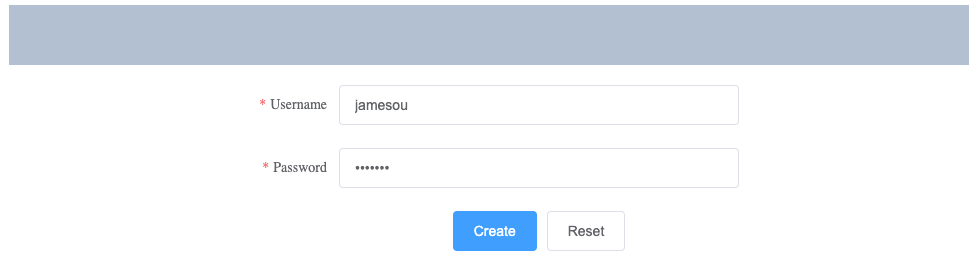
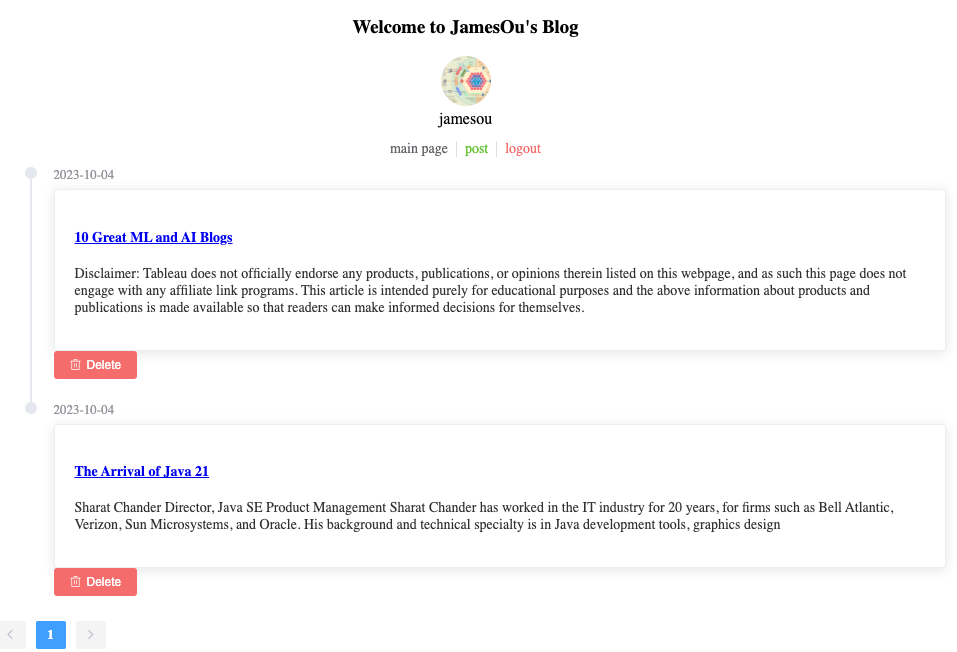
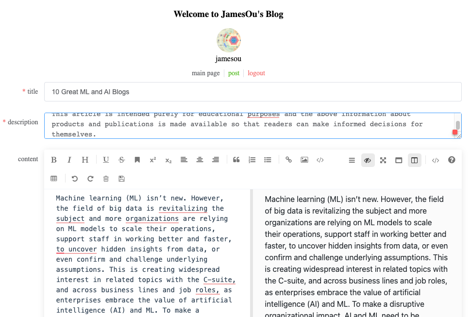
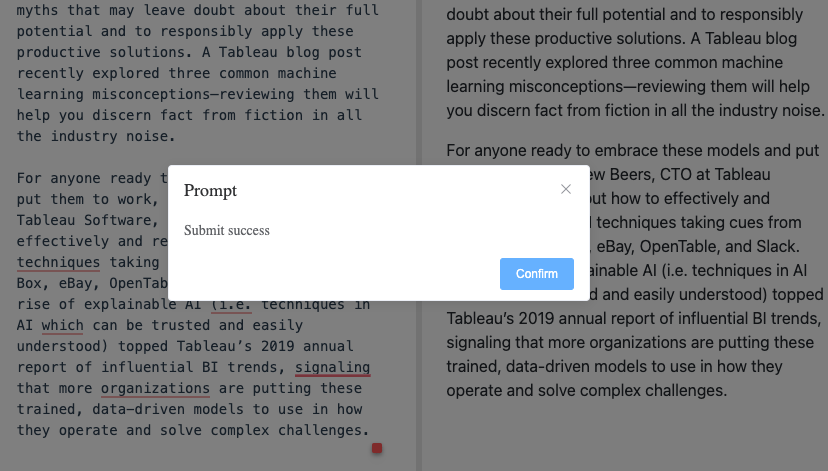

# Simple_Springboot_Vue
## Description
This project is mainly based on Java8, using Vue+SpringBoot+Mybatis+Redis+Postgresql to achieve a simple project of front-end separation. It is based on a simple MVC three-layer architecture implementation and fits the majority of application system requirements.
## Snapshots

